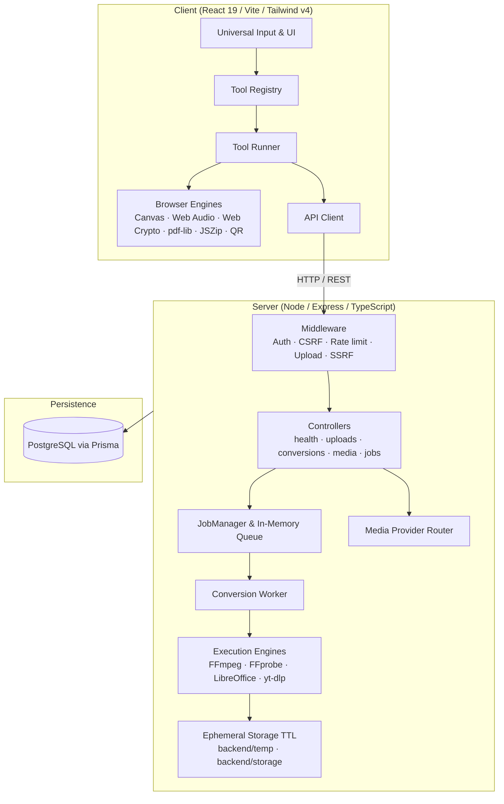

# VELYXORA

A free, open-source, privacy-first toolkit for everyday file, media and document
transformation tasks. VELYXORA runs most operations entirely in the browser and
only sends files to a server when native tooling such as FFmpeg, FFprobe,
LibreOffice or yt-dlp is genuinely required.

VELYXORA is licensed under the **GNU Affero General Public License v3.0**
(`AGPL-3.0-only`). See [License](#license).

---

## What is VELYXORA?

VELYXORA is a web application that bundles dozens of file and media utilities
into a single interface: image conversion, PDF creation, audio/video
transcoding, media analysis, QR/barcode generation, WhatsApp link helpers,
developer utilities and more.

It is designed around three ideas:

- **Free to use.** There are no plans, credits, balances, paywalls or paid
  gating. Server processing is protected only by technical fair-use limits.
- **Privacy first.** Whenever a task can be completed with browser APIs, the
  file never leaves the device.
- **Honest engineering.** If a capability depends on an external binary that is
  not present, VELYXORA reports that fact instead of fabricating results.

## Current status

VELYXORA is under active development and is **not yet a formal public release**.
The application is usable, but interfaces, tool coverage and infrastructure may
still change.

- The previous commercial model (credits, plans, manual payments) was **retired**.
- The code is free to use and open source under AGPLv3.
- Some tools depend on host binaries (FFmpeg, FFprobe, LibreOffice, yt-dlp) and
  remain limited by the environment where the server runs.
- See [CHANGELOG.md](CHANGELOG.md) for verifiable recent changes.

## Features

Tools are grouped by area in `frontend/src/registry/tools.ts`:

- **Images** — PNG/JPG/WebP conversion, compression, resizing, cropping,
  filters, watermarking, SVG rasterization, base64 export, favicons, color
  extraction and a 512×512 sticker maker.
- **Video** — container conversion, compression, trimming, mute, speed,
  resolution changes and frame extraction.
- **Audio** — trimming, channel conversion, format/bitrate conversion,
  normalization and browser text-to-speech.
- **Documents & PDF** — images/text to PDF, PDF merge and split, and
  Word/Excel/PowerPoint/OpenDocument → PDF through LibreOffice.
- **Media downloader** — URL analysis and download through yt-dlp for
  supported public sources.
- **Developer & text utilities** — JSON/CSV/Markdown converters, JWT decoding,
  hashing, UUID/password generation, diffs, regex testing and more.
- **QR, barcode and WhatsApp** — QR/barcode generation and local WhatsApp link
  helpers.
- **Everyday utilities** — color, unit, timestamp, aspect-ratio and storage
  converters.

The exact, authoritative catalog is the tool registry in code, not this list.

## Processing model

Every tool declares a `processingMode` in its registry entry:

| `processingMode`    | Meaning                                                         |
| ------------------- | --------------------------------------------------------------- |
| `CLIENT_SIDE`       | Runs entirely in the browser; the file never leaves the device. |
| `SERVER_SIDE`       | Requires backend execution and native binaries.                 |
| `HYBRID`            | Client-first, with server processing where needed.              |
| `EXTERNAL_PROVIDER` | Resolves public data through external providers (SSRF-guarded). |

Conceptually these map onto **CLIENT_SIDE / SERVER_REQUIRED / EXTERNAL**
execution. Server-dependent tools require an authenticated session and are
subject to technical limits, not payment.

The current source of truth is:
`frontend/src/types.ts` (`ProcessingMode`), `frontend/src/config/processingPolicy.ts`
and `frontend/src/registry/tools.ts`.

## Privacy model

- **Client-side tools** process bytes in browser memory. No upload occurs.
- **Server tools** upload to bounded, ephemeral temporary storage that is
  cleaned up automatically (default TTL: 30 minutes). Files are not used for
  anything other than the requested job.
- **External analysis** validates URLs against SSRF protections and only queries
  supported public endpoints. No social credentials, cookies, DRM bypass,
  authentication or paywall circumvention are used.
- Download results are served as attachments from temporary storage and expire.

## Architecture



The unified build uses the root `vite.config.ts` (project root is `frontend/`,
output is `dist/`) and the unified development server is `server.ts`. The
`frontend/` directory keeps its own `vite.config.ts` only for optional
standalone frontend development.

## Tech stack

- **Frontend:** React 19, TypeScript, Vite 6, Tailwind CSS v4, `pdf-lib`,
  `jszip`, `qrcode`, `lucide-react`, `motion`.
- **Backend:** Node.js 22, Express 4, TypeScript, `multer`, `express-rate-limit`.
- **Database:** Prisma ORM with PostgreSQL.
- **Native engines:** FFmpeg / FFprobe, LibreOffice (headless), yt-dlp.
- **Testing:** Node's built-in test runner with `tsx`, plus `supertest`.

## Screenshots / demo

No screenshots or hosted demo URLs are committed to this repository yet.
This section will be updated when stable public assets exist. No placeholder
images or unverified links are included.

## Quick start

Requirements:

- **Node.js 22.x**
- **npm** — the package manager used by this project
- **PostgreSQL** for auth, persistence and server jobs
- Optional native binaries for server tools: FFmpeg/FFprobe, LibreOffice, yt-dlp

The official flow is npm from the repository root. The root `package-lock.json`
is the authoritative lockfile, installed with `npm ci` in CI and the Docker
image. `frontend/` and `backend/` also ship standalone `package.json` and
`package-lock.json` files for optional independent development; Bun is not used
or required.

```bash
# Install dependencies from the repository root
npm install

# Create your local environment files (see next section)
# Copy .env.example -> .env and adjust the values.

# Prepare the database client and schema
npm run db:generate
npm run db:migrate

# Start the unified development server (frontend + backend on port 3000)
npm run dev
```

Open `http://localhost:3000`.

## Environment configuration

Copy the examples and fill them in locally. Never commit real secrets.

- Root: `.env.example` → `.env`
- Backend: `backend/.env.example` → `backend/.env`
- Frontend: `frontend/.env.example` → `frontend/.env` (only `VITE_API_URL`)

Key variables (see the `.env.example` files for the authoritative list):

| Variable                        | Purpose                                              |
| ------------------------------- | ---------------------------------------------------- |
| `NODE_ENV`                      | `development` / `production` / `test`.               |
| `PORT`                          | Backend port (default `3000`).                       |
| `VITE_API_URL`                  | Frontend API origin.                                 |
| `CORS_ORIGIN`                   | Allowed frontend origin(s), comma-separated.         |
| `SESSION_COOKIE_SAME_SITE`      | `lax` or `none` (cross-site deployments).            |
| `DATABASE_URL`                  | PostgreSQL connection string.                        |
| `AUTH_PASSWORD_PEPPER`          | Required stable secret; changing it invalidates hashes. |
| `MAX_UPLOAD_SIZE_MB`            | Hard upload ceiling.                                 |
| `STORAGE_DIR` / `TEMP_DIR`      | Ephemeral result/upload directories with TTL.        |
| `FFMPEG_PATH` / `FFPROBE_PATH`  | FFmpeg/FFprobe executables.                          |
| `LIBREOFFICE_PATH`              | LibreOffice `soffice` executable.                    |
| `YT_DLP_PATH`                   | yt-dlp executable.                                   |
| `TRUST_PROXY`                   | Enable behind a reverse proxy (e.g. `true` on Railway). |

Values shown are documentation only. Do not commit production secrets.

## Database setup

VELYXORA uses Prisma against PostgreSQL.

```bash
npm run db:generate   # generate Prisma Client
npm run db:migrate    # apply migrations (prisma migrate deploy)
npm run db:seed       # optional: seed initial/admin data
```

`INITIAL_ADMIN_EMAIL` and `INITIAL_ADMIN_PASSWORD` are only for the first seed.
Remove `INITIAL_ADMIN_PASSWORD` from the environment afterwards. Public
registration never creates `ADMIN` accounts.

## Development

```bash
npm run dev            # unified frontend + backend (port 3000)
npm run build:frontend # Vite production build -> dist/
npm run build:backend  # prisma generate + esbuild backend bundle
npm run build          # full production build
npm start              # run the production server
```

Binary requirements for server tools:

- **FFmpeg/FFprobe:** install via your package manager and ensure it is on
  `PATH`, or set `FFMPEG_PATH`/`FFPROBE_PATH`.
- **LibreOffice:** install `soffice` and set `LIBREOFFICE_PATH`.
- **yt-dlp:** install the official binary and set `YT_DLP_PATH`.

Without these binaries, the corresponding server tools report that the engine
is unavailable rather than producing fabricated output.

## Testing

```bash
npm test          # root test suite (backend + frontend)
npm run typecheck # tsc --noEmit
npm run lint      # eslint frontend/src backend/src server.ts
npm run build     # verify the production build
```

Integration tests that require FFmpeg or LibreOffice skip themselves when the
corresponding binary is not available locally. Some backend tests require a
reachable PostgreSQL database configured by `DATABASE_URL`.

## Project structure

```text
velyxora/
├── frontend/                 # React 19 / Vite / Tailwind client
│   ├── src/
│   │   ├── components/       # UI and tool runners
│   │   ├── config/           # processing policy, support, service status
│   │   ├── registry/         # tools.ts — tool catalog
│   │   ├── services/         # client engines and apiClient
│   │   └── types.ts          # shared frontend types
│   └── test/                 # frontend tests
├── backend/                  # Node / Express / TypeScript API
│   └── src/
│       ├── config/           # environment and limits
│       ├── controllers/      # health, uploads, conversions, media, jobs
│       ├── engines/          # FFmpeg, LibreOffice, image engines
│       ├── jobs/ workers/    # job manager and processing worker
│       ├── providers/        # media provider adapters
│       ├── routes/           # API routes
│       ├── security/         # SSRF, upload policy, auth middleware
│       └── services/         # job, storage, media, usage services
├── prisma/                   # schema and tracked SQL migrations
├── docs/                     # engineering documentation
├── server.ts                 # unified full-stack server
└── package.json              # root orchestrator manifest
```

## Adding a new tool

1. **Add a definition** to `frontend/src/registry/tools.ts` with a unique `id`
   and `slug`, `category`, `inputTypes`/`outputTypes`, and a `processingMode`
   of `CLIENT_SIDE`, `SERVER_SIDE`, `HYBRID` or `EXTERNAL_PROVIDER`.
2. **Choose the runner kind.** `getToolRunnerKind` maps a definition to an
   existing runner. Reuse an existing runner before adding a new one.
3. **Client-side:** implement the engine in `frontend/src/services/` using
   browser APIs or existing dependencies.
4. **Server-side:** implement through the existing API contracts — upload via
   `/api/uploads`, start a job via `/api/conversions`, poll `/api/jobs/:id` and
   download through the returned `fileId`. Use `frontend/src/services/apiClient.ts`
   rather than ad-hoc `fetch` calls.
5. **Do not invent APIs.** Reuse controllers, engines and DTOs that already
   exist. If a genuinely new endpoint is required, document and test it.
6. **Add tests** and run `npm run typecheck`, `npm run lint` and `npm test`.

Tools that have no real runner yet are marked `public: false` in the registry
and are not routable. Do not expose a tool until it has a real implementation.

## Security

See [SECURITY.md](SECURITY.md) for how to report vulnerabilities.

Summary of existing protections:

- **SSRF defense** for external media URLs (loopback, private ranges, link-local
  metadata endpoints and forbidden schemes are blocked).
- **Path-traversal protection** on uploaded and generated paths.
- **Ephemeral storage with TTL** for temporary files.
- **Rate limiting** across sensitive endpoints.
- **Session auth + CSRF** for authenticated server processing.

Never commit secrets. Credentials belong only in local environment files.

## Fair use

VELYXORA is free, but server processing is a shared resource. Technical
safeguards (configured in `backend/src/config/freeServiceLimits.ts`) bound
uploads, concurrency and pending files per account to keep the service
available for everyone. These limits are technical, not commercial, and are not
tied to payment or support.

## Voluntary support

Supporting VELYXORA is entirely optional and never unlocks features, credits or
priorities. The application exposes voluntary support options from
`frontend/src/config/supportMethods.ts`, which is the single source of truth for
the configured methods. Methods are shown and activated only when explicitly
configured, and the app never processes payments or stores financial data.

See [SUPPORT.md](SUPPORT.md) for usage and support guidance.

## Contributing

Contributions are welcome through pull requests against the official repository:
<https://github.com/wanglingtech/Velyxora>

Please read [CONTRIBUTING.md](CONTRIBUTING.md) and [CODE_OF_CONDUCT.md](CODE_OF_CONDUCT.md)
before opening a pull request. All contributions are subject to review and
acceptance by the maintainer.

## Roadmap

The roadmap lives in [docs/TODO.md](docs/TODO.md). Highlights include wiring
cancellation through running native processes, expanding real tool coverage,
and accessibility/responsive polish. A roadmap item is not implemented merely
because it is listed.

## License

VELYXORA is licensed under the **GNU Affero General Public License v3.0**
(SPDX: `AGPL-3.0-only`). See [LICENSE](LICENSE) for the full text.

The VELYXORA name and branding are separate from the software license. The
AGPLv3 grant covers the source code; it does not grant rights to use the
VELYXORA name or branding as an official representation of the project. See the
[LICENSE](LICENSE) notice for details.

Because VELYXORA is server software, the AGPL's network-use condition applies:
if you run a modified version as a network service, you must offer its
Corresponding Source to users interacting with it.

## Acknowledgements

VELYXORA builds on third-party open-source software and tools, including but not
limited to React, Vite, Tailwind CSS, Express, Prisma, `pdf-lib`, `jszip`,
`qrcode`, FFmpeg/FFprobe, LibreOffice and yt-dlp. Each dependency and external
binary remains under its own license and terms; see the respective project for
details. Please use external integrations only with content you own or are
authorized to process.
